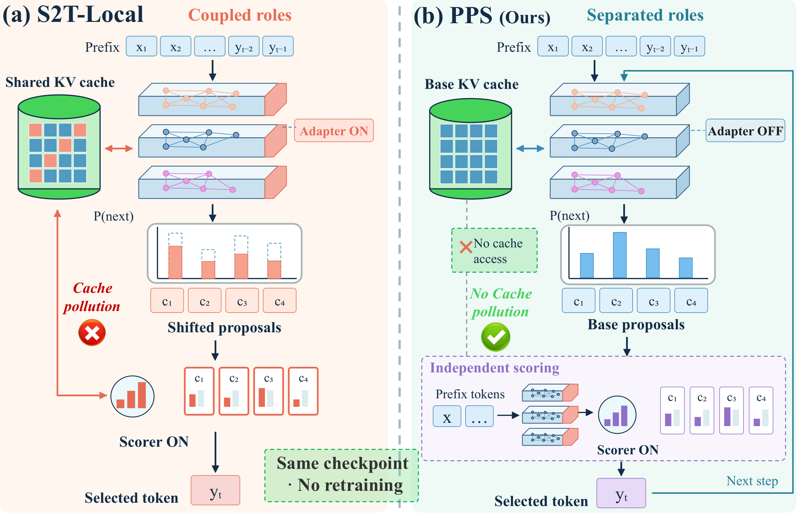
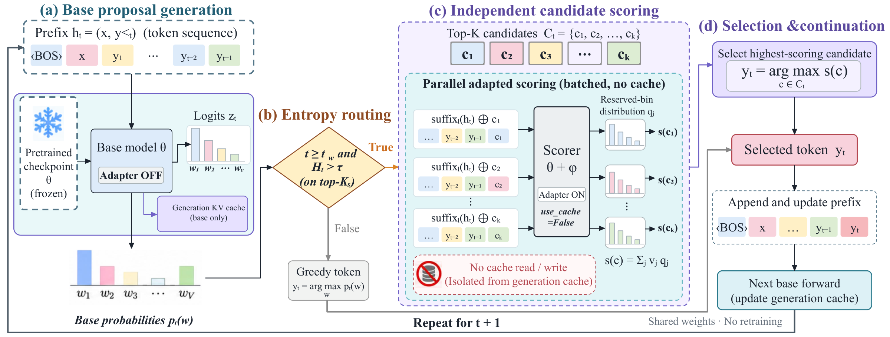
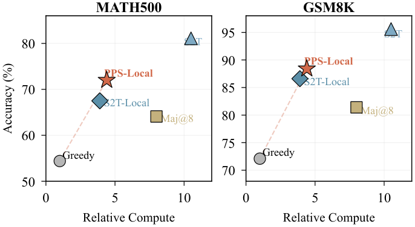
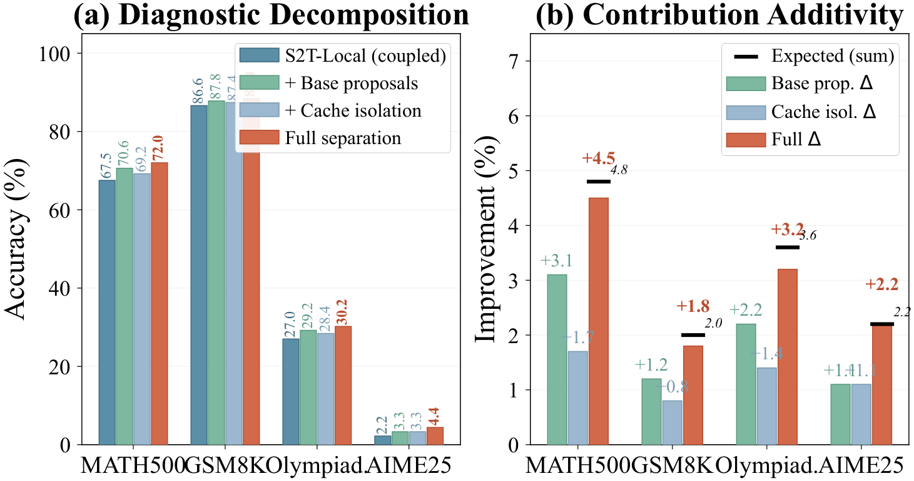

# Keep the Proposer

### Deployment Separation for Local Selection in Small Language Models

**Proposal-Preserving Selection (PPS)** · Anonymous submission

PPS improves small language model reasoning by keeping the base model in charge
of proposal generation and using a trained scoring adapter only to rank candidate
tokens. It reuses the same checkpoint and requires **no additional training**.

<p align="center">
  
</p>

## What changes at deployment?

A scoring adapter can change the very proposals it is asked to evaluate. PPS
separates these roles at inference:

1. **Propose with the base model.** Disable the adapter for generation, including
   the forward passes that construct and update the generation KV cache.
2. **Score only when needed.** At entropy-triggered steps, enable the adapter for
   a batch of candidate-specific forward passes. Reserved-token logits provide
   an expected-bin score for each candidate.
3. **Keep scoring independent.** Candidate scoring uses `use_cache=False` and does
   not access the generation cache. Restore the base route before continuing.

<p align="center">
  
</p>

**PPS-Local** uses the local scoring adapter and needs no teacher at inference.
The manuscript also studies a **teacher-scored PPS** variant. The packaged PPS
wrapper and paired evaluation workflow implement **PPS-Local**; the shared
upstream decoder also retains its original teacher-guided policies.

## Results reported in the manuscript

The following values are transcribed from the current manuscript's **Table 2**
for **Qwen2.5-1.5B-Instruct**. Scores are percentages; HumanEval uses pass@1.
These are paper-reported results, not measurements from a release-time run.

| Benchmark | S2T-Local | PPS-Local | Change (percentage points) |
|---|---:|---:|---:|
| GSM8K | 86.6 | **88.4** | +1.8 |
| MATH500 | 67.5 | **72.0** | +4.5 |
| OlympiadBench | 27.0 | **30.2** | +3.2 |
| AIME25 | 2.2 | **4.4** | +2.2 |
| HumanEval | 56.9 | **59.7** | +2.8 |
| MMLU-Pro | 33.6 | **36.6** | +3.0 |
| Minerva Math | 52.6 | **56.2** | +3.6 |
| GaoKao2024 | **60.8** | 60.2 | -0.6 |

The manuscript's cost comparison reports 4.4× greedy-decoding time for PPS-Local
versus 3.9× for S2T-Local, approximately **13% additional time**, with the same
trained adapter.

<p align="center">
  
</p>

<details>
<summary>Paper diagnostic figure: proposal generation and cache isolation</summary>

<p align="center">
  
</p>

This figure is exported from the manuscript. The released paired evaluator
compares native deployment with PPS-Local; it is not a driver for all four
diagnostic configurations shown in the figure.

</details>

## Repository layout

```text
.
├── assets/paper/                # Manuscript figures displayed above
├── autores/
│   ├── split_adapter.py         # PPS routing wrapper; core server implementation
│   ├── evaluate_local.py        # Native / base_proposals paired evaluation
│   ├── compare_local.py         # Paired correctness, wins, losses, and scope checks
│   ├── prepare.py              # Pinned model and dataset preparation
│   ├── prepare_quick_subsets.py # Fixed evaluation subsets
│   ├── prepare_teacher.py      # Pinned 4-bit teacher download
│   ├── teacher_smoke.py        # Teacher/tokenizer compatibility check
│   ├── smoke_joint.py          # Joint student/teacher hardware check
│   ├── collect_online.py       # Teacher-supervised candidate collection
│   ├── train_lowmem.py         # Single-GPU scoring-adapter training
│   ├── memory_objective.py     # Chunked prefix KL objective
│   └── check_*.py              # Small CPU structural and training checks
├── scripts/                    # Shared S2T decoder, trainer, utilities, grader
├── configs/                    # Input revisions, source hashes, paper settings
├── docs/reproduction.md         # Exact release scope and packaging changes
├── run_checks.sh
├── run_paired_eval.sh
├── requirements.txt
└── requirements-teacher.txt
```

Experiment logs, generated answers, training examples, checkpoints, model
weights, caches, and unrelated experimental branches are excluded. Runtime
artifacts are written under the ignored `work/` directory by default.

## Installation

Use **Linux and Python 3.12** for the server workflow. GPU evaluation and training
require CUDA; file locking and grading timeouts use Linux APIs. The small
structural checks run on CPU without downloading a pretrained model.

From the repository root, create an environment, install the PyTorch build
appropriate for your CUDA installation, then install the remaining dependencies:

```bash
python3.12 -m venv .venv
source .venv/bin/activate
python -m pip install -r requirements.txt

export AUTO3_ROOT="$PWD/work"
export HF_HOME="$AUTO3_ROOT/cache/huggingface"
export PYTHONPATH="$PWD/scripts:$PWD/autores${PYTHONPATH:+:$PYTHONPATH}"
export PYTHONUTF8=1
export TOKENIZERS_PARALLELISM=false
mkdir -p "$AUTO3_ROOT"
```

For the archived teacher-label collection workflow, also run:

```bash
python -m pip install -r requirements-teacher.txt
```

The original single-GPU adaptation used a 24 GB GPU and a prequantized 32B
teacher. Memory requirements depend on context length and the runtime. The
paper's BF16 teacher configuration is distinct from this archived adaptation.

## Quick check: verify deployment separation

```bash
bash run_checks.sh
```

These checks use tiny random models to verify that proposal logits match the
base model, scoring retains the adapter, adapter state is restored, and the
memory-efficient training objective preserves losses and gradients. They do not
measure benchmark accuracy.

## Reproduce the archived server workflow

### 1. Prepare inputs

```bash
python autores/prepare.py
python autores/prepare_quick_subsets.py
```

Preparation downloads the student and public datasets using the revisions in
`configs/server_data_manifest.json`, verifies the frozen data hashes, and checks
for question overlap. MATH's original 7,500 training examples are partitioned
into 7,340 training, 32 calibration, and 128 development examples. The quick
evaluation uses fixed 128-example subsets of MATH500 and GSM8K and all 30 AIME25
examples.

### 2. Obtain a scoring adapter

If you already have the compatible server checkpoint, place its complete `final/`
directory under `work/checkpoints/teacher_bootstrap_v1/`. Evaluation expects the
checkpoint's `checkpoint_manifest.json` and the train-only calibration traces at
`work/results/teacher_bootstrap_v1/collection/calibration_rollouts.jsonl`.
The manifest records the required checkpoint files and their hashes.

To regenerate the adapter and calibration traces from source:

```bash
python autores/prepare_teacher.py
python autores/teacher_smoke.py
python autores/smoke_joint.py \
  --output "$AUTO3_ROOT/results/teacher_joint_smoke"

python autores/collect_online.py \
  --output "$AUTO3_ROOT/results/teacher_bootstrap_v1/collection" \
  --max-groups 2000 --max-questions 512 \
  --quantile 0.90 --max-tokens 1024 --seed 20261004

python autores/train_lowmem.py \
  --input "$AUTO3_ROOT/results/teacher_bootstrap_v1/collection/groups.jsonl" \
  --output "$AUTO3_ROOT/checkpoints/teacher_bootstrap_v1" \
  --epochs 3 --lr 0.00005 --microbatch 1 --accumulation 4 \
  --kl-chunk 64 --seed 20261004
```

The `0.90` quantile above controls **training-label collection** in the archived
protocol. Evaluation freezes a **0.99 entropy quantile** using training-only
calibration traces. Training a scoring adapter is a prerequisite shared with
S2T-Local; switching that adapter to PPS requires no further optimization.

### 3. Compare the two deployment modes

```bash
# Fixed subsets used by the archived paired experiments:
bash run_paired_eval.sh

# Alternatively, evaluate the complete supported benchmark splits:
bash run_paired_eval.sh \
  "$AUTO3_ROOT/checkpoints/teacher_bootstrap_v1/final" full
```

The two modes load the **same checkpoint**:

```bash
# Coupled/native deployment:
python autores/evaluate_local.py \
  --checkpoint "$AUTO3_ROOT/checkpoints/teacher_bootstrap_v1/final" \
  --input "$AUTO3_ROOT/data/math500_quick128.jsonl" \
  --output "$AUTO3_ROOT/results/example_native" \
  --generation-adapter-mode native

# PPS-Local: base generation, adapted scoring:
python autores/evaluate_local.py \
  --checkpoint "$AUTO3_ROOT/checkpoints/teacher_bootstrap_v1/final" \
  --input "$AUTO3_ROOT/data/math500_quick128.jsonl" \
  --output "$AUTO3_ROOT/results/example_pps" \
  --generation-adapter-mode base_proposals
```

Generated predictions, run configuration, hashes, and summaries are stored
locally. Completed runs are checked before reuse; resumed runs reject changes to
their frozen configuration. Use a fresh output directory when changing a setup.

## Reproduction scope

This release preserves the original server implementation. Its archived paired
experiments use **Qwen2.5-1.5B-Instruct, seed 20261004, a 4-bit training teacher,
and fixed MATH500/GSM8K subsets plus AIME25**. The manuscript reports a broader
three-seed, three-model-size, eight-benchmark study. The README's paper results
and figures describe that manuscript; the bundled server workflow does not
constitute a complete reproduction of every paper table or ablation.

See [reproduction details](docs/reproduction.md) for supported inputs, preserved
behavior, and the small portability changes made for this source release.

## Acknowledgments

The implementation builds on Select-to-Think. See
NOTICE.md for source attribution. Model and dataset ownership and
licenses remain with their respective providers.
